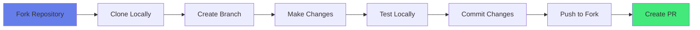
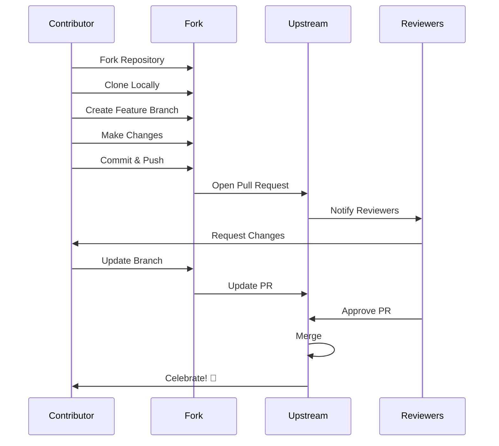
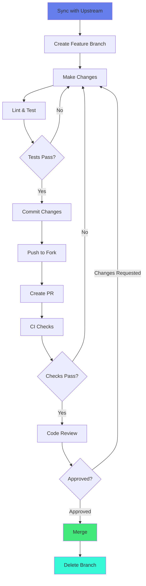

<div align="center">


<br>

[](http://makeapullrequest.com)
[](https://www.firsttimersonly.com/)
[](CODE_OF_CONDUCT.md)

<br>

**Thank you for investing your time in contributing to GitReadme!**  
Your contributions help developers worldwide showcase their work professionally.

</div>

<br>

---

## 📑 Table of Contents

- [Code of Conduct](#-code-of-conduct)
- [Getting Started](#-getting-started)
  - [Development Environment](#-development-environment)
  - [Contribution Workflow](#-contribution-workflow)
- [Contribution Types](#-contribution-types)
- [Template Submission](#-template-submission)
  - [Quality Standards](#-quality-standards)
  - [Submission Checklist](#-submission-checklist)
- [Pull Request Process](#-pull-request-process)
- [Code Review](#-code-review-process)
- [Style Guidelines](#-style-guidelines)
- [Testing & Validation](#-testing--validation)
- [Community](#-community)
- [Recognition](#-recognition)

<br>

---

## 📜 Code of Conduct

### Our Commitment

We are committed to providing a welcoming, inclusive, and harassment-free experience for everyone, regardless of:

- Age, body size, disability, ethnicity, gender identity and expression
- Level of experience, education, socio-economic status
- Nationality, personal appearance, race, religion
- Sexual identity and orientation

### Expected Behavior

<table>
<tr>
<td width="50%">

#### ✅ **Professional Conduct**

- Use welcoming and inclusive language
- Respect differing viewpoints and experiences
- Accept constructive criticism gracefully
- Focus on what's best for the community
- Show empathy towards others
- Provide helpful, constructive feedback

</td>
<td width="50%">

#### ❌ **Unacceptable Behavior**

- Trolling, insulting, or derogatory comments
- Personal or political attacks
- Public or private harassment
- Publishing others' private information
- Sexual language or imagery
- Other unprofessional conduct

</td>
</tr>
</table>

### Enforcement

Violations may result in:
1. **Warning** - First offense, corrective guidance
2. **Temporary Ban** - Repeated violations
3. **Permanent Ban** - Serious or continued violations

Report incidents to: [conduct@gitreadme.dev](mailto:conduct@gitreadme.dev)

<br>

---

## 🚀 Getting Started

### 🔧 Development Environment



#### Prerequisites

```bash
# Required
✅ GitHub account
✅ Git installed locally
✅ Markdown editor (VS Code recommended)
✅ Basic markdown knowledge

# Recommended
⭐ GitHub CLI (gh)
⭐ Markdown linting tools
⭐ Browser for testing renders
```

#### Initial Setup

```bash
# 1. Fork the repository on GitHub

# 2. Clone your fork
git clone https://github.com/YOUR_USERNAME/GitReadme.git
cd GitReadme

# 3. Add upstream remote
git remote add upstream https://github.com/PointCase/GitReadme.git

# 4. Verify remotes
git remote -v
# origin    https://github.com/YOUR_USERNAME/GitReadme.git (fetch)
# origin    https://github.com/YOUR_USERNAME/GitReadme.git (push)
# upstream  https://github.com/PointCase/GitReadme.git (fetch)
# upstream  https://github.com/PointCase/GitReadme.git (push)
```

### 🔄 Contribution Workflow



<br>

---

## 🎯 Contribution Types

We welcome various types of contributions:

<table>
<tr>
<th width="25%">Type</th>
<th width="40%">Description</th>
<th width="20%">Difficulty</th>
<th width="15%">Impact</th>
</tr>
<tr>
<td>

**🎨 New Template**

</td>
<td>

Submit your own GitHub profile README template

</td>
<td>

⭐⭐ Moderate

</td>
<td>

🔥 High

</td>
</tr>
<tr>
<td>

**🔧 Template Fix**

</td>
<td>

Fix broken links, outdated info, or errors in existing templates

</td>
<td>

⭐ Easy

</td>
<td>

🔥 Medium

</td>
</tr>
<tr>
<td>

**📚 Documentation**

</td>
<td>

Improve README, guides, or comments

</td>
<td>

⭐ Easy

</td>
<td>

🔥 High

</td>
</tr>
<tr>
<td>

**✨ Enhancement**

</td>
<td>

Improve existing templates with new features

</td>
<td>

⭐⭐⭐ Advanced

</td>
<td>

🔥 High

</td>
</tr>
<tr>
<td>

**🐛 Bug Report**

</td>
<td>

Report issues, broken features, or inconsistencies

</td>
<td>

⭐ Easy

</td>
<td>

🔥 Medium

</td>
</tr>
<tr>
<td>

**💡 Feature Request**

</td>
<td>

Propose new features or improvements

</td>
<td>

⭐ Easy

</td>
<td>

🔥 Variable

</td>
</tr>
<tr>
<td>

**🔍 Code Review**

</td>
<td>

Review and provide feedback on pull requests

</td>
<td>

⭐⭐ Moderate

</td>
<td>

🔥 High

</td>
</tr>
<tr>
<td>

**🌐 Translation**

</td>
<td>

Translate documentation to other languages

</td>
<td>

⭐⭐ Moderate

</td>
<td>

🔥 Very High

</td>
</tr>
</table>

<br>

---

## 📝 Template Submission

### 🎯 Quality Standards

Before submitting a template, ensure it meets our quality criteria:

#### **Technical Requirements**

| Requirement | Description | Mandatory |
|------------|-------------|:---------:|
| **Valid Markdown** | Proper syntax, no rendering errors | ✅ Yes |
| **Working Links** | All URLs and images load correctly | ✅ Yes |
| **No Sensitive Data** | No API keys, tokens, or personal info | ✅ Yes |
| **Responsive Design** | Works on mobile and desktop | ✅ Yes |
| **Theme Compatible** | Works in light and dark modes | ⚠️ Recommended |
| **Accessible** | Proper alt text, color contrast | ⚠️ Recommended |

#### **Content Requirements**

```yaml
Structure:
  - header: Professional introduction
  - about: Clear personal/professional description
  - skills: Technology stack or expertise
  - stats: GitHub statistics (optional but recommended)
  - projects: Featured repositories or work
  - contact: Professional contact methods
  
Quality:
  - spelling: No typos or grammatical errors
  - formatting: Consistent styling throughout
  - professionalism: Appropriate tone and content
  - originality: Unique design or approach
```

### ✅ Submission Checklist

Before submitting your template, verify:

<details>
<summary><b>📋 Pre-Submission Verification</b></summary>

<br>

#### **Content Verification**

- [ ] Template is unique and not a duplicate
- [ ] All personal information removed/generalized
- [ ] Links use placeholders (e.g., `YOUR_USERNAME`)
- [ ] No offensive or inappropriate content
- [ ] Professional tone maintained throughout
- [ ] Template includes documentation/comments

#### **Technical Verification**

- [ ] Markdown syntax is valid
- [ ] All images load correctly
- [ ] All links are functional
- [ ] Works in GitHub's markdown renderer
- [ ] No console errors or warnings
- [ ] Tested on mobile viewport
- [ ] Tested in light/dark themes

#### **Quality Verification**

- [ ] Spell-checked and proofread
- [ ] Consistent formatting applied
- [ ] Code is clean and organized
- [ ] Follows our style guide
- [ ] Includes attribution for borrowed code
- [ ] README.md updated (if needed)
- [ ] templates.json updated

#### **Legal Verification**

- [ ] You own or have rights to all content
- [ ] Proper attribution for third-party assets
- [ ] No copyright violations
- [ ] Agrees with repository license (MIT)

</details>

### 📄 Template File Structure

```markdown
<!-- templates/your-template.md -->

<!--
  Template Name: Your Template Name
  Author: @yourusername
  Category: Minimal|Feature-Rich|Creative|Professional
  Description: Brief description of your template
  Features: List key features (Stats, Badges, etc.)
  Setup Difficulty: Easy|Moderate|Advanced
  
  Setup Instructions:
  1. Replace YOUR_USERNAME with your GitHub username
  2. Update social media links
  3. Customize skills and technologies
  4. [Any special setup required]
-->

<!-- Your template content here -->
```

### 🗂️ Update templates.json

Add your template metadata:

```json
{
  "id": "template-yourname",
  "name": "Your Template Name",
  "description": "A compelling one-line description",
  "category": "Minimal|Feature-Rich|Creative|Professional",
  "file": "your-template.md",
  "author": {
    "name": "Your Name",
    "github": "yourusername",
    "url": "https://github.com/yourusername"
  },
  "tags": ["minimal", "stats", "animated", "etc"],
  "features": [
    "GitHub Stats",
    "Contribution Streak",
    "Social Links",
    "Skill Badges"
  ],
  "difficulty": "easy|moderate|advanced",
  "preview": "https://github.com/yourusername",
  "lastUpdated": "2025-12-08"
}
```

<br>

---

## 🔀 Pull Request Process

### Step-by-Step Guide



#### **1. Sync Your Fork**

```bash
# Update your fork with latest upstream changes
git checkout main
git fetch upstream
git merge upstream/main
git push origin main
```

#### **2. Create Feature Branch**

```bash
# Use descriptive branch names
git checkout -b template/awesome-profile
# or
git checkout -b fix/broken-links-template-name
# or
git checkout -b docs/improve-contributing-guide
```

**Branch Naming Convention:**

| Type | Prefix | Example |
|------|--------|---------|
| New Template | `template/` | `template/minimalist-dev` |
| Bug Fix | `fix/` | `fix/broken-badges` |
| Documentation | `docs/` | `docs/update-readme` |
| Enhancement | `feat/` | `feat/add-wakatime-integration` |
| Refactor | `refactor/` | `refactor/reorganize-categories` |

#### **3. Make Your Changes**

```bash
# Add your template
cp your-awesome-template.md templates/

# Update templates.json
# Edit templates/templates.json

# Test locally (view in GitHub or use markdown previewer)
```

#### **4. Commit Your Changes**

Follow **Conventional Commits** specification:

```bash
# Format: <type>(<scope>): <subject>

git add templates/your-template.md templates/templates.json

# Examples:
git commit -m "feat(templates): add minimalist developer profile template"
git commit -m "fix(template-name): repair broken social media links"
git commit -m "docs(readme): improve quick start guide"
git commit -m "refactor(templates): reorganize minimal category"
```

**Commit Types:**

- `feat`: New feature or template
- `fix`: Bug fix or correction
- `docs`: Documentation changes
- `style`: Formatting, whitespace changes
- `refactor`: Code restructuring
- `test`: Adding or updating tests
- `chore`: Maintenance tasks

#### **5. Push to Your Fork**

```bash
git push origin template/awesome-profile
```

#### **6. Create Pull Request**

Use our PR template:

```markdown
## 📋 Description

Brief description of your changes

## 🎯 Type of Change

- [ ] ✨ New template
- [ ] 🐛 Bug fix
- [ ] 📚 Documentation update
- [ ] ⚡ Enhancement
- [ ] 🔧 Refactoring

## 📝 Template Information (if applicable)

- **Template Name:** Awesome Developer Profile
- **Category:** Minimal / Feature-Rich / Creative / Professional
- **Difficulty:** Easy / Moderate / Advanced
- **Key Features:** 
  - GitHub Stats
  - Contribution Streak
  - Social Links
- **Preview:** [Link to your profile using this template]

## ✅ Checklist

- [ ] I have tested this template thoroughly
- [ ] All links are working correctly
- [ ] Images load properly
- [ ] Works in light AND dark modes
- [ ] Tested on mobile viewport
- [ ] Updated `templates.json`
- [ ] Followed style guide
- [ ] No sensitive information included
- [ ] Spell-checked and proofread
- [ ] Added appropriate comments/documentation

## 📸 Screenshots (optional)

Light Mode:


Dark Mode:


Mobile View:


## 📝 Additional Notes

Any special setup instructions, dependencies, or context for reviewers
```

<br>

---

## 👀 Code Review Process

### Review Criteria

Reviewers will evaluate based on:

<table>
<tr>
<th width="30%">Criteria</th>
<th width="50%">What We Check</th>
<th width="20%">Priority</th>
</tr>
<tr>
<td>

**✅ Functionality**

</td>
<td>

- All links work correctly
- Images load properly
- No broken elements
- Renders correctly

</td>
<td>

🔴 Critical

</td>
</tr>
<tr>
<td>

**🎨 Quality**

</td>
<td>

- Professional appearance
- Consistent styling
- No spelling/grammar errors
- Clean code

</td>
<td>

🟠 High

</td>
</tr>
<tr>
<td>

**📚 Documentation**

</td>
<td>

- Clear setup instructions
- Proper attribution
- Helpful comments
- Updated metadata

</td>
<td>

🟠 High

</td>
</tr>
<tr>
<td>

**🔐 Security**

</td>
<td>

- No API keys exposed
- No personal data
- Safe external links
- No malicious code

</td>
<td>

🔴 Critical

</td>
</tr>
<tr>
<td>

**♿ Accessibility**

</td>
<td>

- Alt text on images
- Good color contrast
- Screen reader friendly
- Semantic markdown

</td>
<td>

🟡 Medium

</td>
</tr>
</table>

### Review Timeline

```mermaid
gantt
    title PR Review Timeline
    dateFormat  DD
    section PR Lifecycle
    Initial Review       :a1, 01, 3d
    Feedback Round      :a2, after a1, 2d
    Updates by Author   :a3, after a2, 2d
    Final Review        :a4, after a3, 1d
    Merge               :milestone, after a4, 0d
```



- **Initial Review**: 1-3 days
- **Feedback**: Reviewers provide constructive feedback
- **Revision**: Author addresses feedback
- **Re-review**: 1-2 days
- **Merge**: Once approved by 2+ reviewers

### Responding to Feedback

```bash
# Make requested changes
git add .
git commit -m "fix: address review feedback"
git push origin your-branch-name

# PR automatically updates
```

**Best Practices:**

- ✅ Respond to ALL comments
- ✅ Ask questions if unclear
- ✅ Make changes promptly
- ✅ Thank reviewers
- ✅ Keep discussions professional
- ❌ Don't take feedback personally
- ❌ Don't argue unnecessarily

<br>

---

## 🎨 Style Guidelines

### Markdown Formatting

```markdown
<!-- Headers: Use proper hierarchy -->
# Main Title (H1) - Once per document
## Section (H2)
### Subsection (H3)
#### Detail (H4)

<!-- Lists: Consistent bullet types -->
- Unordered item
- Another item
  - Nested item

1. Ordered item
2. Second item

<!-- Links: Descriptive text -->
✅ GOOD: Check out my [portfolio website](https://example.com)
❌bad: Click [here](https://example.com)

<!-- Images: Include alt text -->


<!-- Code: Use fenced blocks -->
```bash
echo "Hello, World!"
```

<!-- Emphasis: Use sparingly -->
*italic* for emphasis
**bold** for strong emphasis
```

### Badge Styling

Use consistent badge styles from [shields.io](https://shields.io):

```markdown
<!-- Recommended styles -->


<!-- Color schemes: Use hex colors or named colors -->
?color=667eea
?color=blue
?color=success
```

### File Organization

```text
GitReadme/
├── templates/
│   ├── minimal/          # Minimal templates (future organization)
│   ├── feature-rich/
│   ├── creative/
│   └── professional/
├── README.md
├── CONTRIBUTING.md
├── LICENSE
└── templates.json
```

<br>

---

## 🧪 Testing & Validation

### Local Testing

```bash
# 1. Visual Test
- Open template in GitHub markdown preview
- Or use VS Code markdown preview (Ctrl+Shift+V)
- Or use online tool: https://dillinger.io

# 2. Link Validation
- Click every link to verify functionality
- Check that images load
- Verify external services work

# 3. Responsiveness
- Test on desktop viewport
- Test on mobile viewport (DevTools)
- Check in different browsers

# 4. Theme Testing
- View in light mode
- View in dark mode
- Check color contrast
```

### Automated Checks

Our CI/CD pipeline automatically checks:

✅ Markdown lint validation  
✅ Link checking  
✅ Image accessibility  
✅ File size limits  
✅ JSON syntax validation  
✅ Spelling checks  

<br>

---

## 🌐 Community

### Getting Help

- 💬 **[GitHub Discussions](https://github.com/PointCase/GitReadme/discussions)** - Ask questions, share ideas
- 🐛 **[GitHub Issues](https://github.com/PointCase/GitReadme/issues)** - Report bugs, request features
- 📧 **Email** - [support@gitreadme.dev](mailto:support@gitreadme.dev)

### Communication Channels

<div align="center">

| Channel | Purpose | Response Time |
|:-------:|:-------:|:-------------:|
|  | Bug reports, feature requests | 1-2 days |
|  | Q&A, ideas, help | 1-3 days |
|  | Real-time chat | Varies |
|  | Private inquiries | 2-5 days |

</div>

### Community Events

- 🎯 **Template of the Month** - Featured template each month
- 🏆 **Contributor Spotlight** - Recognize top contributors
- 💡 **Feedback Friday** - Community feedback sessions
- 🚀 **Release Parties** - Celebrate major milestones

<br>

---

## 🏆 Recognition

### Contributor Levels

<table>
<tr>
<th>Level</th>
<th>Requirements</th>
<th>Privileges</th>
</tr>
<tr>
<td>

**⭐ Contributor**

</td>
<td>

1+ merged PR

</td>
<td>

- Listed in README
- Contributor badge

</td>
</tr>
<tr>
<td>

**🌟 Active Contributor**

</td>
<td>

5+ merged PRs

</td>
<td>

- Special mention
- Early access to features
- Vote on major decisions

</td>
</tr>
<tr>
<td>

**💫 Core Contributor**

</td>
<td>

15+ merged PRs  
Consistent engagement

</td>
<td>

- Triage permissions
- Review PRs
- Shape project direction

</td>
</tr>
<tr>
<td>

**✨ Maintainer**

</td>
<td>

Invited by team  
Sustained contributions

</td>
<td>

- Write access
- Merge permissions
- Project leadership

</td>
</tr>
</table>

### Rewards & Recognition

- 🏅 **Featured in README** - All contributors listed
- 🎖️ **Monthly Spotlight** - Top contributor each month
- 🏆 **Annual Awards** - "Best Template", "Most Helpful", etc.
- 💝 **Swag** - Stickers, t-shirts for core contributors
- 📣 **Social Shoutouts** - Twitter/LinkedIn recognition

<br>

---

## 📚 Additional Resources

### Learning Resources

- [GitHub Markdown Guide](https://guides.github.com/features/mastering-markdown/)
- [GitHub Profile README Guide](https://docs.github.com/en/account-and-profile/setting-up-and-managing-your-github-profile/customizing-your-profile/managing-your-profile-readme)
- [Shields.io Documentation](https://shields.io/)
- [Conventional Commits](https://www.conventionalcommits.org/)

### Tooling

- [VS Code](https://code.visualstudio.com/) - Recommended editor
- [Markdown All in One](https://marketplace.visualstudio.com/items?itemName=yzhang.markdown-all-in-one) - VS Code extension
- [markdownlint](https://github.com/DavidAnson/markdownlint) - Linting tool
- [Dillinger](https://dillinger.io/) - Online markdown editor

### Inspiration

- [Awesome README](https://github.com/matiassingers/awesome-readme)
- [Awesome GitHub Profile README](https://github.com/abhisheknaiidu/awesome-github-profile-readme)
- [GitHub Profile Trophy](https://github.com/ryo-ma/github-profile-trophy)

<br>

---

## 📄 License

By contributing, you agree that your contributions will be licensed under the [MIT License](LICENSE).

<br>

---

<div align="center">

## 🙏 Thank You!

**Every contribution, no matter how small, makes a difference.**  
We appreciate your time, effort, and dedication to making GitReadme better!

<br>

### 💖 Join Our Community

<p>
  <a href="https://github.com/PointCase/GitReadme">
    
  </a>
  <a href="https://github.com/PointCase/GitReadme/discussions">
    
  </a>
  <a href="https://discord.gg/your-discord">
    
  </a>
</p>

<br>

**Happy Contributing! 🚀**

<br>


</div>
