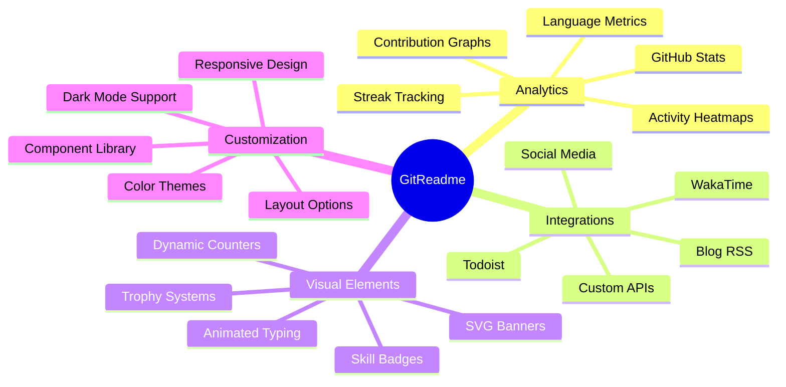
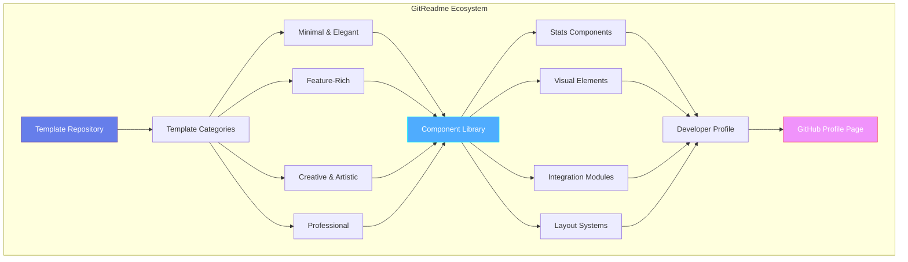
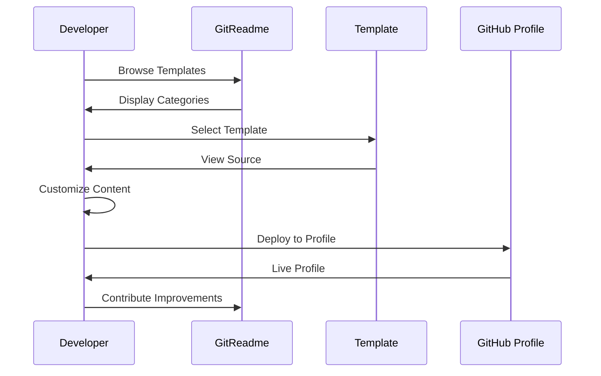
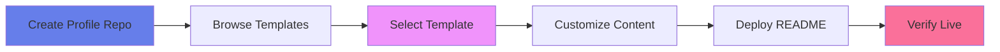
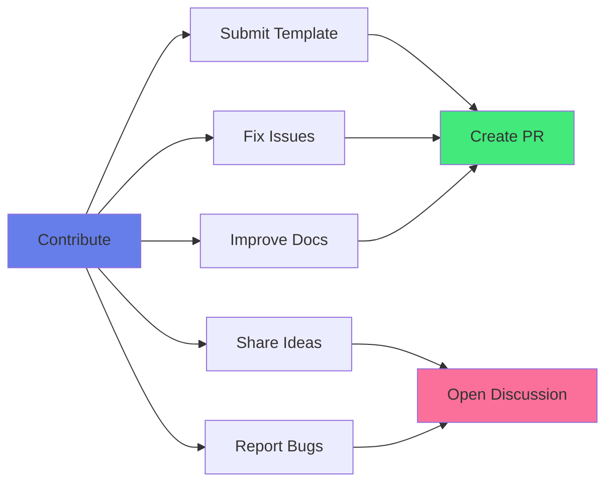

<div align="center">

<!-- HEADER BANNER -->


<p align="center">
  
</p>

<!-- ADVANCED BADGE MATRIX -->
<p align="center">
  <!-- Repository Stats -->
  <a href="https://github.com/PointCase/GitReadme/stargazers">
    
  </a>
  <a href="https://github.com/PointCase/GitReadme/network/members">
    
  </a>
  <a href="https://github.com/PointCase/GitReadme/issues">
    
  </a>
</p>

<p align="center">
  <!-- Activity & Quality -->
  
  
  <a href="LICENSE">
    
  </a>
</p>

<p align="center">
  <!-- Community -->
  <a href="CONTRIBUTING.md">
    
  </a>
  <a href="https://github.com/PointCase/GitReadme/graphs/contributors">
    
  </a>
  
</p>

<br>

---

### 📊 **Repository Analytics Dashboard**

```text
┌─────────────────────────────────────────────────────────────────┐
│  📦 Templates    │  👥 Contributors  │  ⭐ Stars  │  🔱 Forks   │
│  ════════════    │  ══════════════   │  ════════  │  ═══════    │
│      44+         │   Community       │  Star us!  │  Fork now!  │
└─────────────────────────────────────────────────────────────────┘
```

</div>

<br>

<!-- TABLE OF CONTENTS -->
<details>
<summary><b>📑 Table of Contents</b></summary>

- [Overview](#-overview)
- [Key Features](#-key-features)
- [Architecture](#-architecture)
- [Template Ecosystem](#-template-ecosystem)
  - [Minimal & Elegant](#1%EF%B8%8F⃣-minimal--elegant)
  - [Feature-Rich](#2%EF%B8%8F⃣-feature-rich--comprehensive)
  - [Creative & Artistic](#3%EF%B8%8F⃣-creative--artistic)
  - [Professional & Corporate](#4%EF%B8%8F⃣-professional--corporate)
- [Quick Start Guide](#-quick-start-guide)
- [Advanced Customization](#-advanced-customization)
- [Integration Toolkit](#-integration-toolkit)
- [Template Matrix](#-template-matrix)
- [Best Practices](#-best-practices)
- [Contributing](#-contributing)
- [Community](#-community)
- [License](#-license)

</details>

<br>

---

## 🎯 Overview

<div align="center">

**GitReadme** is a curated, enterprise-grade collection of **44+ professionally crafted GitHub profile README templates**, meticulously selected from top developers worldwide. Each template represents best practices in developer branding, technical presentation, and professional portfolio design.

</div>

### 🌟 Why GitReadme?

<table>
<tr>
<td width="50%">

#### **For Developers**
- 🚀 **Instant Professional Presence** - Deploy production-ready profiles in minutes
- 🎨 **Diverse Design Systems** - From minimalist to feature-complete architectures
- 📊 **Data-Driven Insights** - Integrated analytics and achievement tracking
- 🔧 **Fully Customizable** - Modular components for infinite possibilities
- 📱 **Responsive Design** - Optimized for all viewing contexts

</td>
<td width="50%">

#### **For Teams**
- 📚 **Standardized Branding** - Consistent team member profiles
- 🎯 **Onboarding Toolkit** - Fast-track new developer profiles
- 💼 **Recruitment Ready** - Showcase team expertise professionally
- 🏆 **Achievement Showcase** - Highlight team contributions
- 🔄 **Version Controlled** - Git-based template management

</td>
</tr>
</table>

<br>

---

## ✨ Key Features

<div align="center">



</div>

<br>

<details>
<summary><b>🔍 Feature Deep Dive</b></summary>

<br>

### 📊 **Analytics & Metrics**

| Feature | Description | Integration |
|---------|-------------|-------------|
| **GitHub Stats Cards** | Comprehensive contribution statistics with customizable themes | [github-readme-stats](https://github.com/anuraghazra/github-readme-stats) |
| **Streak Statistics** | Contribution streak tracking with milestone celebrations | [github-readme-streak-stats](https://streak-stats.demolab.com) |
| **Activity Graphs** | Visual representation of coding activity over time | [github-readme-activity-graph](https://github.com/Ashutosh00710/github-readme-activity-graph) |
| **WakaTime Integration** | Real-time coding time tracking and language breakdown | [WakaTime](https://wakatime.com) |
| **Language Analysis** | Top languages with percentage distribution | Built-in Stats API |
| **Trophy Collection** | Achievement badges and milestone recognition | [github-profile-trophy](https://github.com/ryo-ma/github-profile-trophy) |

### 🎨 **Visual Components**

| Component | Purpose | Customization Level |
|-----------|---------|-------------------|
| **Animated Headers** | Eye-catching profile introductions | High |
| **Typing SVG** | Dynamic text animations | Medium |
| **Skill Badges** | Technology stack visualization | High |
| **Profile Banners** | Custom branded headers | High |
| **Social Icons** | Platform integration links | Medium |
| **Visitor Counters** | Profile view tracking | Low |

### 🔧 **Technical Capabilities**

- ✅ **Markdown Advanced** - Full GitHub Flavored Markdown support
- ✅ **HTML Embedding** - Enhanced layouts with HTML/CSS
- ✅ **Dynamic Content** - Auto-updating via GitHub Actions
- ✅ **API Integration** - Third-party service connections
- ✅ **Responsive Layout** - Mobile-first design approach
- ✅ **Theme Support** - Light/Dark mode compatibility
- ✅ **Accessibility** - WCAG compliant implementations

</details>

<br>

---

## 🏗️ Architecture

<div align="center">



</div>

### 🔄 **Template Lifecycle**



<br>

---

## 🎨 Template Ecosystem

Our templates are organized into **4 major design philosophies**, each catering to different professional needs and aesthetic preferences.

<br>

### 1️⃣ **Minimal & Elegant**

> *Less is more. Clean, focused, and professional.*

<table>
<tr>
<th>Template</th>
<th>Characteristics</th>
<th>Best For</th>
<th>View</th>
</tr>
<tr>
<td><b>abhisheknaiidu</b></td>
<td>

- WakaTime integration
- Todoist stats
- Minimalist design
- Clean typography

</td>
<td>Productivity-focused developers</td>
<td><a href="templates/abhisheknaiidu.md">📄</a></td>
</tr>
<tr>
<td><b>blueset</b></td>
<td>

- Ultra-minimal
- Text-focused
- Fast loading
- Accessibility first

</td>
<td>Purist developers</td>
<td><a href="templates/blueset.md">📄</a></td>
</tr>
<tr>
<td><b>aaditkamat</b></td>
<td>

- Simple badges
- Essential stats
- Clean layout
- Professional tone

</td>
<td>Traditional profiles</td>
<td><a href="templates/aaditkamat.md">📄</a></td>
</tr>
</table>

<br>

### 2️⃣ **Feature-Rich & Comprehensive**

> *Showcase everything. Stats, skills, and achievements in one place.*

<table>
<tr>
<th width="20%">Template</th>
<th width="35%">Features</th>
<th width="25%">Stats Integration</th>
<th width="20%">View</th>
</tr>
<tr>
<td><b>Candida18</b></td>
<td>

- Complete skills matrix
- Multiple stat cards
- Activity graphs
- Social integration
- Collapsible sections

</td>
<td>

✅ GitHub Stats<br>
✅ Streak Stats<br>
✅ Activity Graph<br>
✅ Top Languages<br>
✅ Visitor Counter

</td>
<td><a href="templates/Candida18.md">📄</a></td>
</tr>
<tr>
<td><b>anonfaded</b></td>
<td>

- Advanced layouts
- Custom styling
- Multiple integrations
- Rich media
- Interactive elements

</td>
<td>

✅ All stats types<br>
✅ Custom themes<br>
✅ API integrations<br>
✅ Real-time data<br>
✅ Trophy system

</td>
<td><a href="templates/anonfaded.md">📄</a></td>
</tr>
<tr>
<td><b>chinmay29hub</b></td>
<td>

- Full-featured layout
- Comprehensive sections
- Rich visualizations
- Project showcase
- Achievement display

</td>
<td>

✅ Complete analytics<br>
✅ Multi-platform<br>
✅ Custom metrics<br>
✅ Time tracking<br>
✅ Contribution maps

</td>
<td><a href="templates/chinmay29hub.md">📄</a></td>
</tr>
</table>

<br>

### 3️⃣ **Creative & Artistic**

> *Stand out from the crowd. Unique designs that make an impression.*

<table>
<tr>
<th>Template</th>
<th>Creative Elements</th>
<th>Target Audience</th>
<th>View</th>
</tr>
<tr>
<td><b>anuraghazra</b></td>
<td>

- Custom header graphics
- Pinned repo cards
- Unique color schemes
- Branded elements

</td>
<td>Open source creators</td>
<td><a href="templates/anuraghazra.md">📄</a></td>
</tr>
<tr>
<td><b>AlexMartinFR</b></td>
<td>

- Artistic layouts
- Custom animations
- Unique typography
- Visual flair

</td>
<td>Creative developers</td>
<td><a href="templates/AlexMartinFR.md">📄</a></td>
</tr>
<tr>
<td><b>Berkeli</b></td>
<td>

- Innovative design
- Interactive components
- Custom graphics
- Animated elements

</td>
<td>Frontend specialists</td>
<td><a href="templates/Berkeli.md">📄</a></td>
</tr>
</table>

<br>

### 4️⃣ **Professional & Corporate**

> *Business-ready profiles for enterprise developers and tech leaders.*

<table>
<tr>
<th>Template</th>
<th>Professional Features</th>
<th>Enterprise Value</th>
<th>View</th>
</tr>
<tr>
<td><b>AhmedFathyDev</b></td>
<td>

- Corporate styling
- Professional metrics
- Certification display
- Experience timeline

</td>
<td>Career advancement, networking</td>
<td><a href="templates/AhmedFathyDev.md">📄</a></td>
</tr>
<tr>
<td><b>adamalston</b></td>
<td>

- Clean corporate design
- Skills taxonomy
- Project portfolio
- Professional summary

</td>
<td>Job seeking, recruitment</td>
<td><a href="templates/adamalston.md">📄</a></td>
</tr>
<tr>
<td><b>DataOnATangent</b></td>
<td>

- Data-focused presentation
- Analytics showcase
- Technical depth
- Research highlights

</td>
<td>Data science, research roles</td>
<td><a href="templates/DataOnATangent.md">📄</a></td>
</tr>
</table>

<br>

---

## 🚀 Quick Start Guide

### Prerequisites

```bash
✅ Active GitHub account
✅ Basic markdown knowledge
✅ 10 minutes of your time
```

### Implementation Steps



<br>

<details>
<summary><b>📋 Detailed Implementation</b></summary>

<br>

#### **Step 1: Create Your Profile Repository**

```bash
# Your repository name MUST match your GitHub username
# Example: if username is "johndoe", create "johndoe/johndoe"

1. Navigate to GitHub
2. Click "New Repository"
3. Name it exactly as your username
4. Check "Add a README file"
5. Create repository
```

#### **Step 2: Choose Your Template**

```bash
# Browse the templates directory
Browse → templates/ → [Find your style]

Categories:
├── Minimal & Elegant/    # Simple, clean designs
├── Feature-Rich/         # Comprehensive stats
├── Creative/             # Unique artistic styles
└── Professional/         # Corporate-ready templates
```

#### **Step 3: Customize**

Replace these placeholders in your chosen template:

| Placeholder | Replace With | Example |
|-------------|--------------|---------|
| `username` | Your GitHub username | `johndoe` |
| `Your Name` | Your actual name | `John Doe` |
| `your.email@domain.com` | Your email | `john@example.com` |
| Social links | Your profile URLs | Twitter, LinkedIn, etc. |
| Skills/Tech | Your tech stack | React, Python, Docker, etc. |

#### **Step 4: Deploy**

```bash
# Copy template content to your profile README
1. Copy entire template content
2. Navigate to your profile repository
3. Edit README.md
4. Paste and customize
5. Commit changes
6. View your profile!
```

#### **Step 5: Enhance (Optional)**

```bash
# Add dynamic features
- Set up WakaTime for coding stats
- Configure GitHub Actions for auto-updates
- Integrate blog RSS feeds
- Add custom badges
- Enable visitor tracking
```

</details>

<br>

---

## ⚙️ Advanced Customization

<details>
<summary><b>🎨 Theme Customization</b></summary>

<br>

### Available Themes

Most stat integrations support multiple themes. Change the `?theme=` parameter:

```markdown
<!-- GitHub Stats Themes -->
?theme=radical        # Purple/Pink gradient
?theme=tokyonight     # Dark blue aesthetic
?theme=dracula        # Purple dark theme
?theme=gruvbox        # Retro warm colors
?theme=github_dark    # GitHub's dark mode
?theme=catppuccin     # Soft pastel colors
```

### Custom Color Schemes

```markdown
<!-- Custom colors for stats cards -->
&title_color=667eea
&text_color=ffffff
&icon_color=764ba2
&bg_color=0d1117
&border_color=667eea
```

</details>

<details>
<summary><b>📊 Stats Configuration</b></summary>

<br>

### GitHub Stats Card Options

```markdown

```

### Language Stats Options

```markdown

```

</details>

<details>
<summary><b>🔧 Component Integration</b></summary>

<br>

### Adding WakaTime Stats

1. **Sign up** at [WakaTime.com](https://wakatime.com)
2. **Install** WakaTime plugin in your IDE
3. **Get API key** from your account
4. **Add to GitHub** profile README:

```markdown
<!--START_SECTION:waka-->
<!--END_SECTION:waka-->
```

5. **Configure GitHub Actions** for auto-updates

### Adding Visitor Counter

```markdown

```

### Adding Trophy Display

```markdown

```

</details>

<br>

---

## 🛠️ Integration Toolkit

<div align="center">

| Service | Purpose | Difficulty | Documentation |
|:-------:|:-------:|:----------:|:-------------:|
|  | Contribution statistics | ⭐ Easy | [Docs](https://github.com/anuraghazra/github-readme-stats) |
|  | Contribution streaks | ⭐ Easy | [Docs](https://github.com/DenverCoder1/github-readme-streak-stats) |
|  | Coding time tracking | ⭐⭐ Moderate | [Docs](https://wakatime.com) |
|  | Custom badges | ⭐ Easy | [Docs](https://shields.io) |
|  | Contribution graphs | ⭐⭐ Moderate | [Docs](https://github.com/Ashutosh00710/github-readme-activity-graph) |
|  | Animated text | ⭐ Easy | [Docs](https://github.com/DenverCoder1/readme-typing-svg) |
|  | Achievement badges | ⭐ Easy | [Docs](https://github.com/ryo-ma/github-profile-trophy) |
|  | Visitor counter | ⭐ Easy | [Docs](https://github.com/antonkomarev/github-profile-views-counter) |

</div>

<br>

---

## 📊 Template Matrix

<div align="center">

**Compare templates by features to find your perfect match**

</div>

| Template | Stats | Badges | Animations | Socials | WakaTime | Difficulty | Category |
|----------|:-----:|:------:|:----------:|:-------:|:--------:|:----------:|----------|
| abhisheknaiidu | ⭐⭐ | ⭐ | ⭐ | ⭐ | ✅ | Easy | Minimal |
| anuraghazra | ⭐⭐⭐ | ⭐⭐ | ⭐⭐ | ⭐⭐ | ❌ | Moderate | Creative |
| Candida18 | ⭐⭐⭐⭐ | ⭐⭐⭐⭐ | ⭐⭐⭐ | ⭐⭐⭐⭐ | ❌ | Advanced | Feature-Rich |
| anonfaded | ⭐⭐⭐⭐⭐ | ⭐⭐⭐⭐⭐ | ⭐⭐⭐⭐ | ⭐⭐⭐⭐⭐ | ✅ | Expert | Feature-Rich |
| blueset | ⭐ | ❌ | ❌ | ❌ | ❌ | Easy | Minimal |
| adamalston | ⭐⭐⭐ | ⭐⭐⭐ | ⭐⭐ | ⭐⭐⭐ | ❌ | Moderate | Professional |
| AhmedFathyDev | ⭐⭐⭐ | ⭐⭐⭐⭐ | ⭐⭐ | ⭐⭐⭐ | ❌ | Moderate | Professional |

<br>

---

## 💡 Best Practices

<table>
<tr>
<td width="50%">

### ✅ **Do's**

- ✔️ **Keep it updated** - Regular maintenance shows dedication
- ✔️ **Be authentic** - Showcase YOUR unique skills
- ✔️ **Use high-quality images** - Optimize for fast loading
- ✔️ **Test responsiveness** - Verify on mobile/desktop
- ✔️ **Include contact info** - Make it easy to reach you
- ✔️ **Showcase projects** - Link to best repositories
- ✔️ **Use analytics** - Data-driven improvements
- ✔️ **Be professional** - Maintain appropriate tone

</td>
<td width="50%">

### ❌ **Don'ts**

- ❌ **Don't overload** - Too many stats = visual clutter
- ❌ **Don't use broken links** - Test all URLs regularly
- ❌ **Don't copy verbatim** - Customize to your profile
- ❌ **Don't expose secrets** - No API keys in code
- ❌ **Don't exaggerate** - Authenticity builds trust
- ❌ **Don't neglect mobile** - Ensure mobile compatibility
- ❌ **Don't forget attribution** - Credit template authors
- ❌ **Don't set and forget** - Update regularly

</td>
</tr>
</table>

<br>

---

## 🤝 Contributing

<div align="center">

**We welcome contributions from developers worldwide!**

[](CONTRIBUTING.md)
[](https://github.com/PointCase/GitReadme/graphs/contributors)

</div>

### 🎯 Ways to Contribute



### 📝 Quick Contribution Guide

1. **Fork** the repository
2. **Create** feature branch: `git checkout -b feature/AmazingTemplate`
3. **Commit** changes: `git commit -m 'Add amazing template'`
4. **Push** to branch: `git push origin feature/AmazingTemplate`
5. **Open** a Pull Request

📚 **Read our [CONTRIBUTING.md](CONTRIBUTING.md) for detailed guidelines**

<br>

---

## 🌐 Community

<div align="center">

### Join Our Growing Community

<p>
  <a href="https://github.com/PointCase/GitReadme/discussions">
    
  </a>
  <a href="https://github.com/PointCase/GitReadme/issues">
    
  </a>
  <a href="https://discord.gg/your-discord">
    
  </a>
</p>

### 🏆 Top Contributors

Thanks to these amazing developers who contributed templates!

<a href="https://github.com/PointCase/GitReadme/graphs/contributors">
  
</a>

*Made with [contrib.rocks](https://contrib.rocks)*

</div>

<br>

---

## 📄 License

<div align="center">

This project is licensed under the **MIT License** - see the [LICENSE](LICENSE) file for details.

```text
MIT License - Free to use, modify, and distribute
Attribution to original template authors appreciated
```

</div>

<br>

---

## 🙏 Acknowledgments

<div align="center">

**Special thanks to all template creators and the open-source community**

| Category | Contributors |
|:--------:|:------------:|
| **Template Authors** | [@abhisheknaiidu](https://github.com/abhisheknaiidu) · [@anuraghazra](https://github.com/anuraghazra) · [@Candida18](https://github.com/Candida18) · [+41 more](templates/) |
| **Tool Creators** | [github-readme-stats](https://github.com/anuraghazra/github-readme-stats) · [streak-stats](https://github.com/DenverCoder1/github-readme-streak-stats) · [shields.io](https://shields.io) |
| **Community** | All contributors, stargazers, and developers using our templates |

<br>

### ⭐ Star History

<a href="https://star-history.com/#PointCase/GitReadme&Date">
  
</a>

</div>

<br>

---

<div align="center">

### 💖 Show Your Support

**If GitReadme helped you, consider:**

<p>
  <a href="https://github.com/PointCase/GitReadme">
    
  </a>
  <a href="https://github.com/PointCase/GitReadme/fork">
    
  </a>
  <a href="https://twitter.com/intent/tweet?text=Check%20out%20GitReadme!%20A%20collection%20of%2044%2B%20professional%20GitHub%20profile%20templates&url=https://github.com/PointCase/GitReadme">
    
  </a>
</p>

<br>

**Made with ❤️  by developers, for developers**

<br>


</div>
